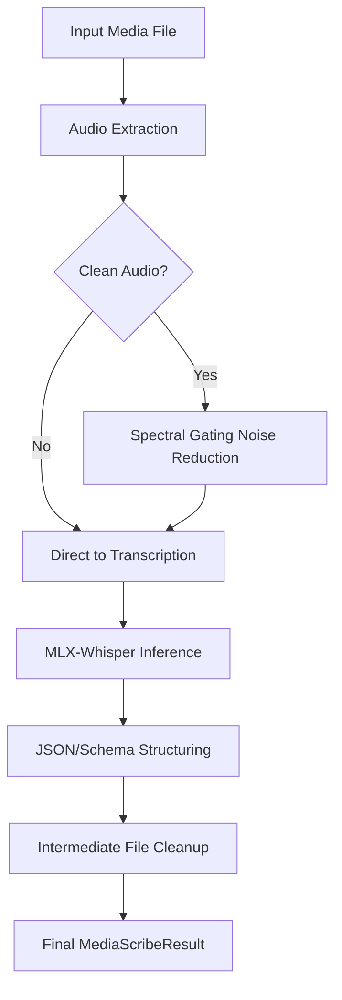

# Media Scribe

Media Scribe is a Python library for processing large audio/video files. It automates media format normalization, performs accurate multi-language transcription with noise reduction, and establishes a structured, log-heavy, and error-resilient pipeline.

## Project Structure & Development Methodology

This project follows a **Specification-Driven Development (SDD)** pattern:

- **`spec/`**: Contains the full specification and architectural documents for the system. Check the `spec` folder to understand the requirements, design, and architecture before referring to the code.
- **`spec/phased-task.md`**: Provides a step-by-step roadmap indicating that this library will be implemented in a phased manner.
- **Iterative Implementation**: The codebase implementation is iterative and closely adheres to the specifications and phased tasks defined in the `spec` folder.

## The MediaScribe Pipeline

When you call `process_media()`, Media Scribe orchestrates the following automated sequence:



### Detailed Pipeline Steps:

1.  **Normalization (Extraction)**: Uses `FFmpeg` to isolate the audio track and convert it into a standard 16kHz Mono WAV. This ensures consistency regardless of whether the source is a 4K video or a low-bitrate voice memo.
2.  **Acoustic Refinement (Optional)**: If `clean_audio=True`, the library uses non-stationary noise reduction (Spectral Gating) to strip away background hum, static, and constant environmental noise before the AI "hears" it.
3.  **Apple Silicon Optimized Inference**: The audio is processed using `mlx-whisper`, utilizing the GPU and Neural Engine on M1/M2/M3/M4 chips for blazing-fast transcription that stays within 16GB RAM limits.
4.  **Language Intelligence**: The pipeline automatically detects the spoken language (Urdu, Arabic, Hindi, English, etc.) and provides confidence scores and segment-level timestamps.
5.  **Data Integrity & Safety**:
    - **Timeouts**: Every step is guarded by a 600-second timeout to prevent zombie processes.
    - **Cleanup**: All intermediate `.wav` files are force-deleted upon completion, ensuring your disk space remains clean.
    - **Strict Schemas**: Returns a `MediaScribeResult` (Pydantic model) for guaranteed data structure in downstream apps.

## Installation

As the library is currently under active development, you can install the dependencies via `requirements.txt`:

```bash
git clone https://github.com/khalidit04/media-scribe.git
cd media-scribe
pip install -r requirements.txt
```

*(Note: Once published, installation will be a simple `pip install media-scribe`)*

## Quickstart

```python
from media_scribe.core import process_media

# Run the end-to-end extraction and transcription pipeline
result = process_media(
    file_path="video.mp4",
    
    # [Optional] Defaults to 'mlx-community/whisper-small-mlx'. 
    # Use 'mlx-community/whisper-large-v3-mlx' for state-of-the-art Arabic/Urdu accuracy.
    model_size="mlx-community/whisper-small-mlx", 
    
    # [Optional] Defaults to False. 
    # Set to True to mathematically remove background static/hum before transcription!
    clean_audio=True 
)

# The pipeline returns a strictly typed Pydantic object with rich metadata:
print(f"Detected Language: {result.detected_language}")
print(f"Total Audio Duration: {result.duration_seconds}s")
print(f"Total Processing Time: {result.processing_time_ms}ms")

# Access the full block of text, or iterate over result.segments for precise timings
print("\nTranscript:")
print(result.full_text)

# [Optional] Export the results to a structured JSON file
from media_scribe.core import export_to_json
export_to_json(result, "transcript.json")
```

## Contributing

We welcome contributions! Because this project is specification-driven:
1. Please thoroughly review the documents in the `spec/` folder.
2. Ensure any new features or architectures align with the existing `implementation_plan.md` and `phased-task.md`.
3. Open an issue to discuss significant changes before submitting a Pull Request.
